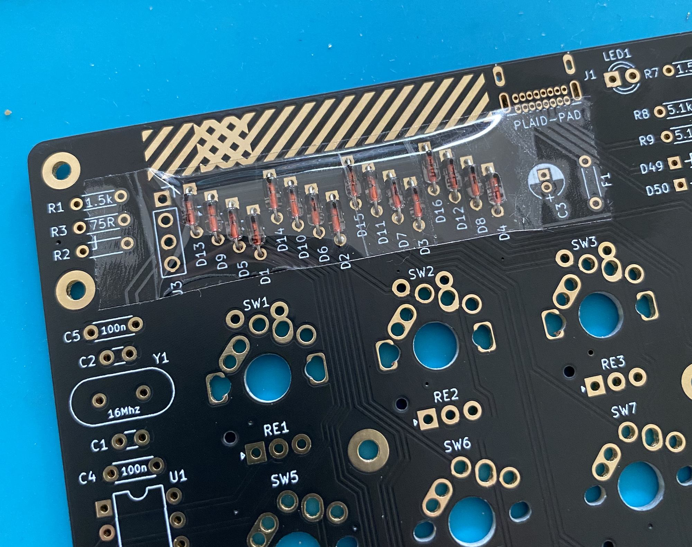
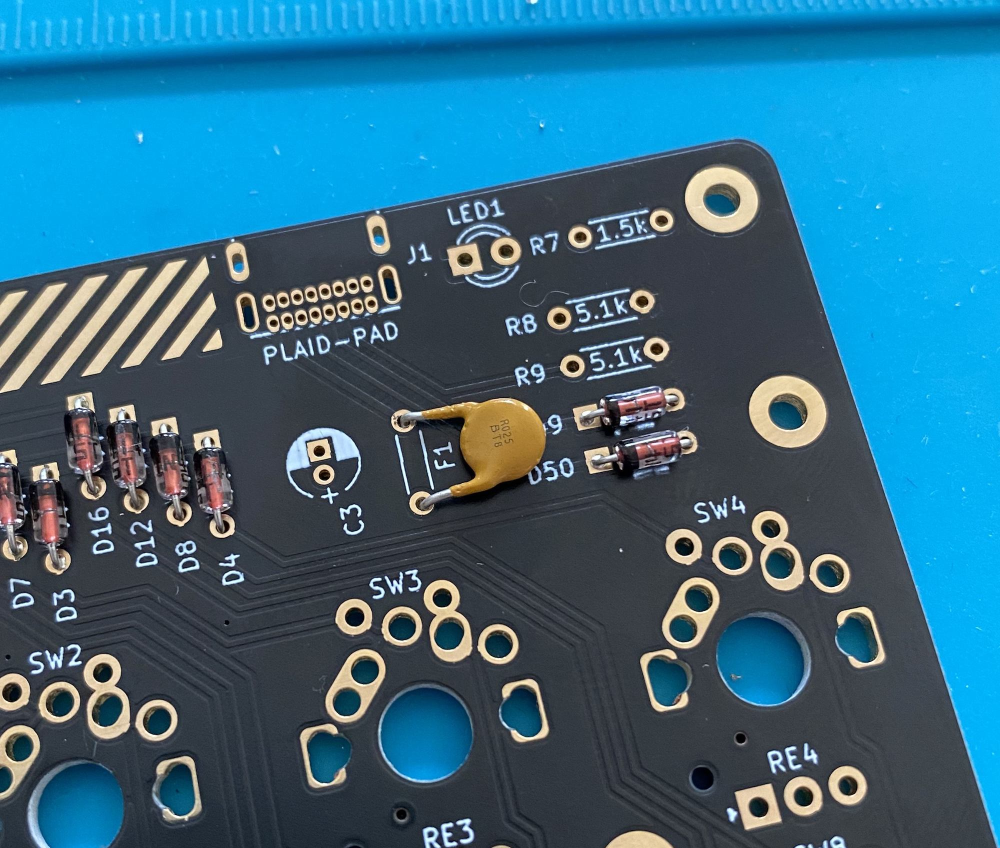
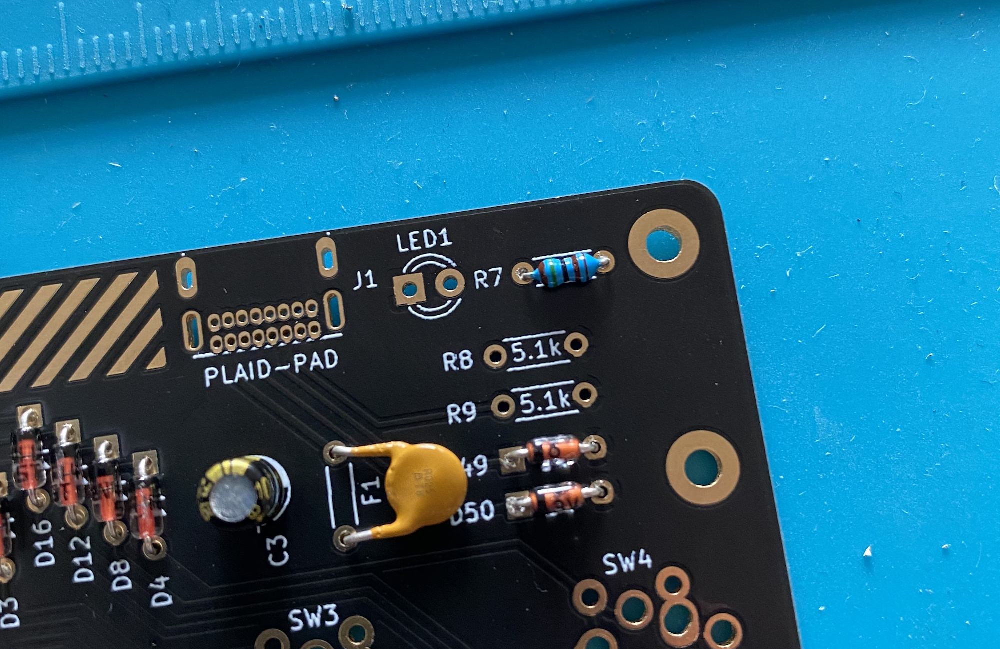
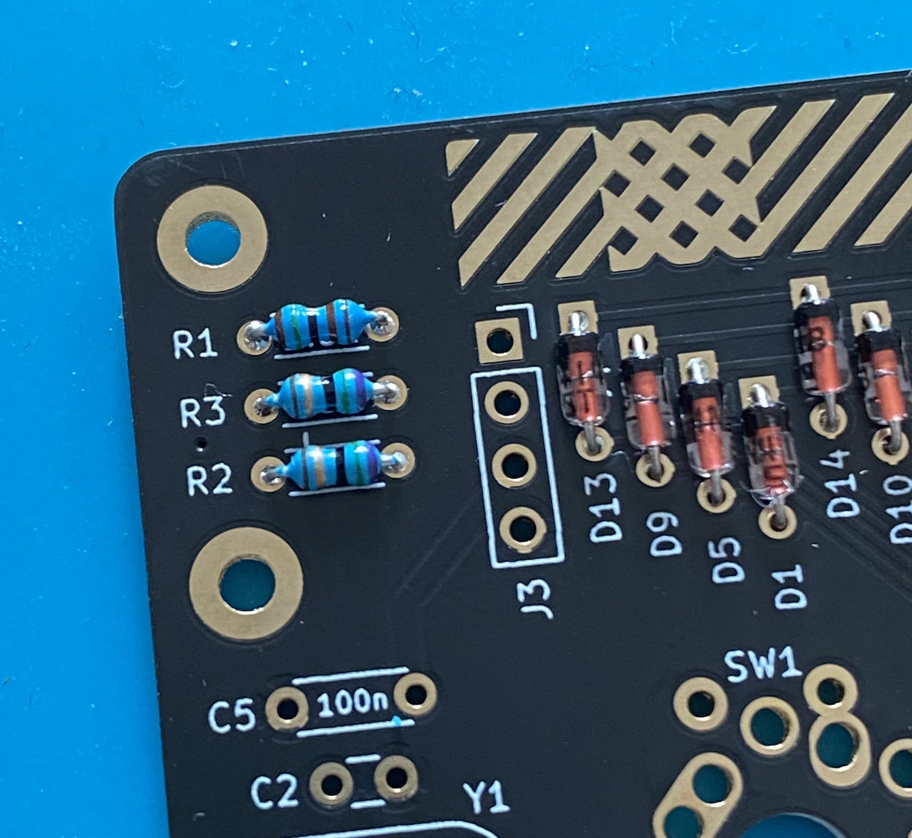
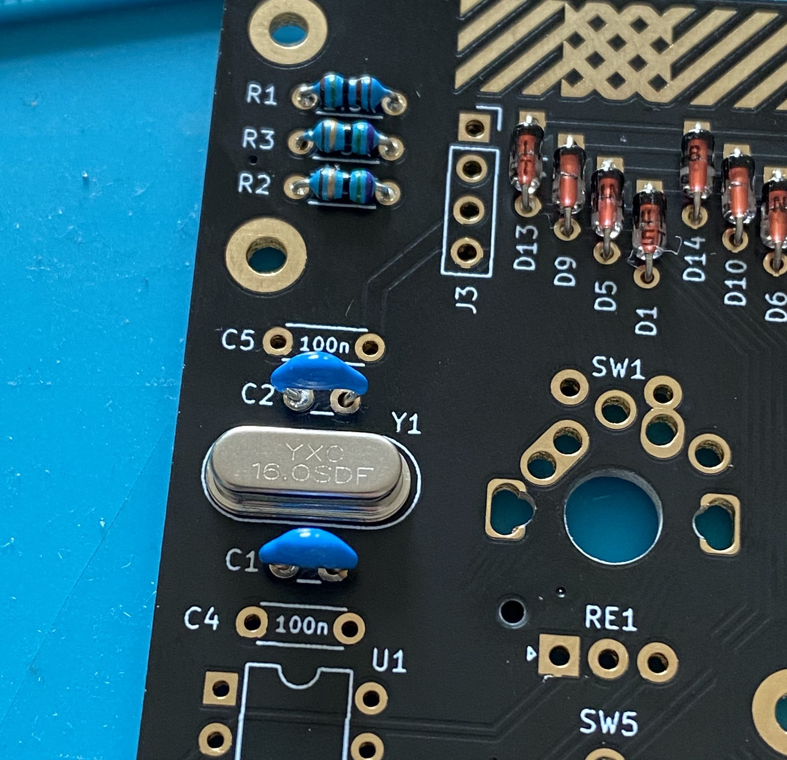

# Build guide

### Diodes 1N4148 (D1-D16)
Diodes are __polarized__. The black line on the diode (cathode) must face to the squared solder pad.
The 1N4148 diodes look similar as Zener diodes. Make sure to not confuse both diodes.

You can use some tape to hold the diodes in place and solder all in one pass.

### Zener diodes (D49, D50)
Diodes are __polarized__. The black line on the diode (cathode) must face to the squared solder pad.
The 1N4148 diodes look similar as Zener diodes. Make sure to not confuse both diodes.

### Resettable fuse(F1)
After soldering bend the fuse like in the image.

### Electrolytic capacitor(C3)
The Electrolytic capacitor is __polarized__. The short leg is cathode. (square pad on pcb)

### Resistors 1.5k Ohm (R1, R7, R8)
- brown, green, black, brown, brown

### Resistors 75 Ohm (R2, R3)
- purple, green, black, gold, brown

### Resistors 10k Ohm (R4)
- brown, black, black, red, brown

### Resistors 5.1k Ohm (R9, R10)
- green, brown, black, brown, brown

### USB-C connector (J1)
Double check that are no short between the pad's.
Best to use a magnifier.

### Led's (LED1, LED2)
Led1 indicates that the Plaid-Pad is powered and constantly on.
I prefer to solder the red led on LED1, because the led is less bright.

### Crystal (Y1)

### Capacitors 22pF (C1, C2)
They have a small pitch (2.5mm).

### Capacitors 0.1uF (C4, C5)
Bigger pitch with 5mm

### IC socket U1
The IC socket is __polarized__. Check the notch on silk and IC Socket.

### Tactile switch (SW50/RESET, SW51/BOOT)

### ATMEGA328p chip
The ATMEGA328 is a __polarized__. Check the notch on the chip and IC Socket.

## Check list before connecting USB
- No short on the USB-C connector pad's
- Direction of polarized components (ATMEGA328p, diode, resettable fuse, electrolytic capacitor)
- Resistor value