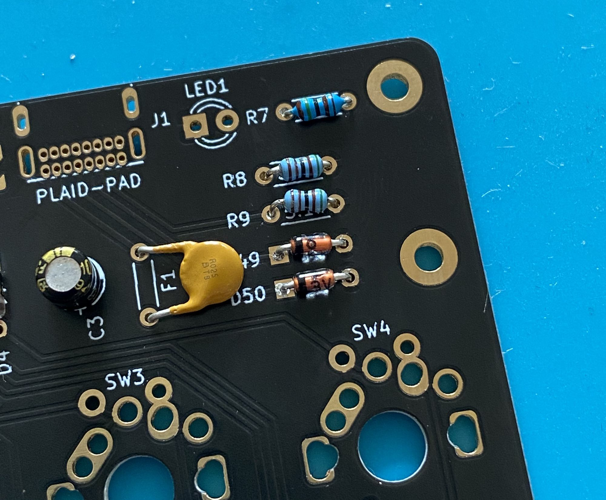
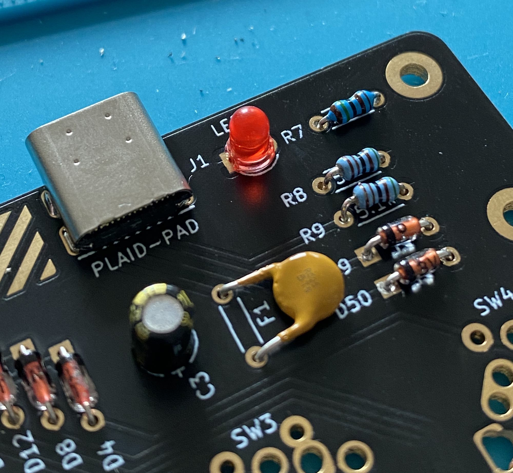
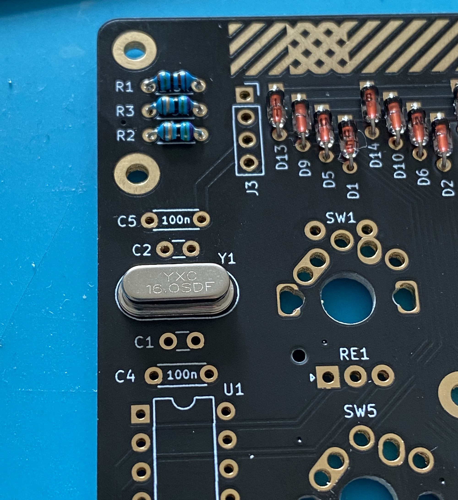
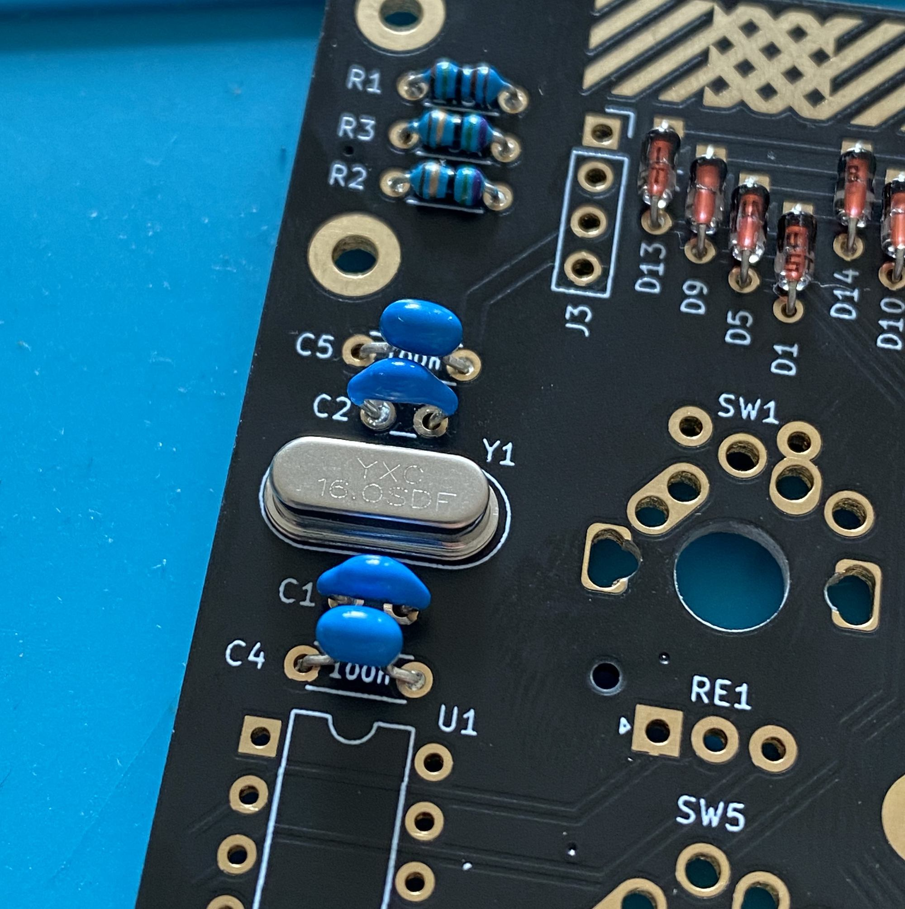
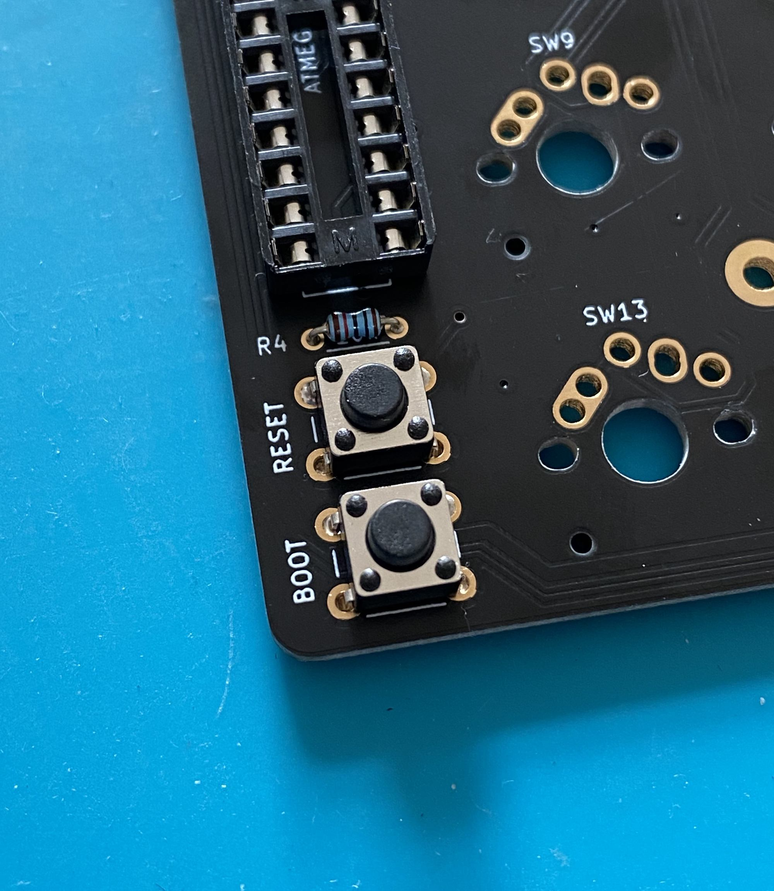
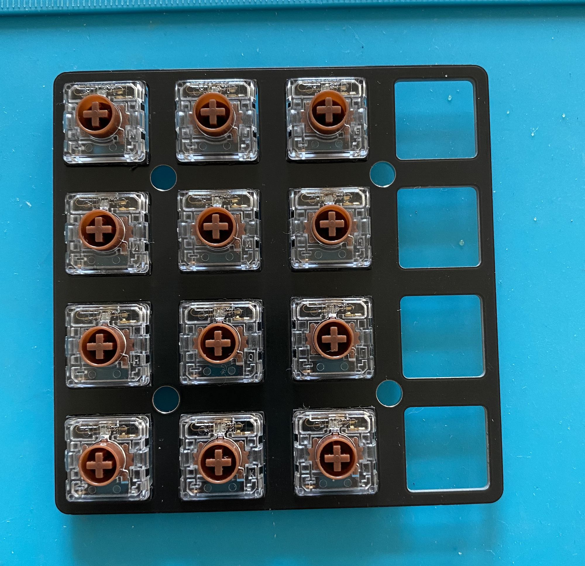
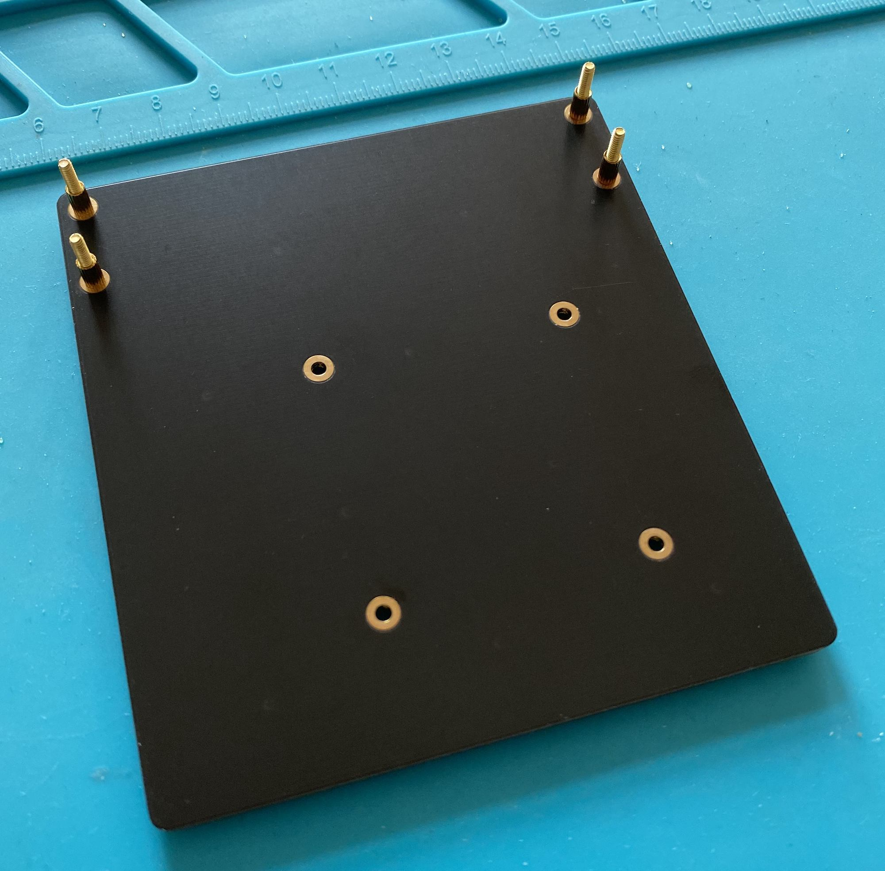

# Build guide for the Plaid-Pad

### Diodes 1N4148 (D1-D16)

Diodes are __polarized__. The black line on the diode (cathode) must face the squared solder pad.
The 1N4148 diodes look similar as Zener diodes - so make sure that you do not confuse both diodes.

You can use some tape, as show in the image, to hold the diodes in place and solder all in one pass.

### Zener diodes (D49, D50)

The diodes are __polarized__ where the black line on the diode (cathode) must face the squared solder pad.
The 1N4148 diodes look similar as Zener diodes - so make sure that you do not confuse both diodes.

### Resettable fuse (F1)

Attach and solder the fuse to `F1`. After soldering, bend the fuse like in the image.

### Electrolytic capacitor (C3)

The Electrolytic capacitor is __polarized__. The short leg is cathode which needs to be attached to the square pad on the PCB.

### Resistors 1.5k Ohm (R1, R7, R8)

Attach the resistors with following colors from left to right:

- brown, green, black, brown, brown

### Resistors 75 Ohm (R2, R3)

Attach the resistors with following colors from left to right:

- purple, green, black, gold, brown

### Resistors 10k Ohm (R4)

Attach the resistors with following colors from left to right:

- brown, black, black, red, brown

### Resistors 5.1k Ohm (R9, R10)

Attach the resistors with following colors from left to right:

- green, brown, black, brown, brown

### USB-C connector (J1)

Double check that there are no short cuts between the solder pads.
A magnifier is handy for this task.

### LEDs (LED1, LED2)

The LEDs are __polarized__. The short leg is the cathode which needs to be attached to the square pad on the PCB

`LED1` indicates that the Plaid-Pad is powered and constantly on.
I prefer to solder the red LED on `LED1`, because the LED is less bright.

### Crystal (Y1)

### Capacitors 22pF (C1, C2)

They have a small pitch (2.5mm).

### Capacitors 0.1uF (C4, C5)

These have a larger pitch of 5mm.

### IC socket U1

The IC socket is __polarized__. Check the notch on the silk and the IC Socket.

### Tactile switch (SW50/RESET, SW51/BOOT)

### ATMEGA328p chip

The ATMEGA328 has to be attached in a __specific direction__. Check the notch on the chip and IC Socket - they need to match. Here, the notch faces the crystal at `Y1`.

## Check list before connecting USB

- No short cuts on the USB-C connector pads
- Direction of polarized and directional components is correct (ATMEGA328p, diode, resettable fuse, electrolytic capacitor, LEDs)
- Resistors with correct values are attached to the target locations

## Test 
_Bootloader and Firmware (VIA keymap) are already on the ATmega328P chip.  
Everything should work after soldering._

Connect the Plaid-Pad to your computer and open the [QMK-Test-Site](https://config.qmk.fm/#/test).

Check whether all switches will work. In order to do so, short the solder pads with tweezers.

## Case assembly 

### Rev2 only (Rev2.1 [skip](#rev21) this step)
 
__Before you solder the switches,__ attach the 4x 5mm spacer to the pcb with the M2x4mm screws.  
__Do not solder the rotary encoder yet.__

 

---

### Rev2.1

Attach all switches to the top plate and place __(not solder)__ the desired amount of the rotary encoder on the pcb ([more information about rotary encoder placement](https://github.com/BenRoe/Plaid-Pad#keymap)).

This way the rotary encoder have room to move and fit perfect into the top plate cutout.

### Rotary encoder and Choc (low profile) switches (skip if you use MX switches)

If you use Choc (low profile) switches, you have to bend the 5 pins of the rotary encoder with a pliers, to fit into the top plate.

---

Put the top plate with the switches on the front side of the pcb.  
Solder the switches and rotary encoder from the bottom side.  
__Ensure that there is no gap between the switch bottom and the pcb. Same for the encoder.__ 

Attach the spacer to the bottom plate.  
Optional: Put the dampening foam on the bottom plate.

Put the assembled top plate with the switches and pcb on the bottom plate.

Screw the 4x 10mm spacer for the guard plate on 12mm prominent screws from below.
Remove the protection film on both sides from the acrylic guard plate.
Fix the acrylic guard plate and the pcb with the 4mm screws.

Put the rubber feeds on the back of the Plaid-Pad.

__The assembly is done.__
  
You can change the keymap with [VIA](https://github.com/BenRoe/Plaid-Pad#qmk-with-via-support), or change the [QMK keymap](https://github.com/BenRoe/Plaid-Pad#qmk-default-keymap) file and reflash the firmware.  
_The current VIA version can't change the rotary encoder function._